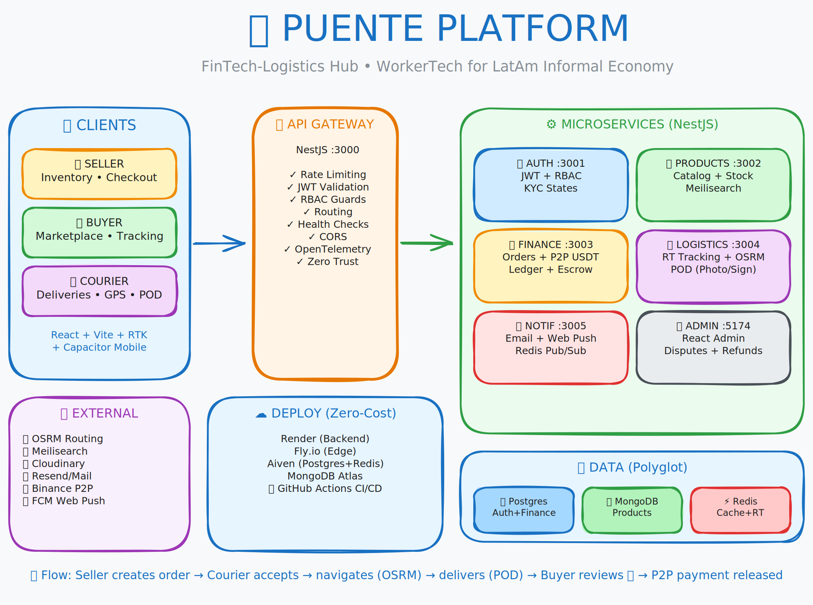

# Puente Platform - Architecture Showcase

🌉 **Live Demo**: [puente-architecture.vercel.app](https://puente-architecture.vercel.app)

A professional landing page showcasing the engineering architecture of **Puente Platform** - a high-performance microservices system designed to bridge the digital gap in LatAm's informal economy.

## 🎯 What This Showcases

- **Microservices Architecture** with NestJS, Docker, and polyglot persistence
- **Real-time Courier Tracking** via WebSockets + Redis GEO
- **OSRM Self-Hosted Routing** with Haversine fallback for 100% uptime
- **Proof of Delivery** with signature capture and Cloudinary integration
- **P2P Crypto Rates** from Binance/CoinGecko for LatAm markets
- **OpenTelemetry** distributed tracing across all services

## 🔗 Related

- **Full Source Code**: [github.com/mikaelpizzi/puente-platform](https://github.com/mikaelpizzi/puente-platform)

---

Built by **Mikael Pizzi** • [LinkedIn](https://linkedin.com/in/mikaelpizzi) • [GitHub](https://github.com/mikaelpizzi)
